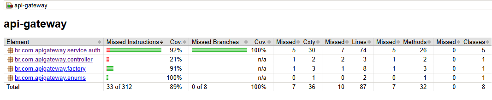
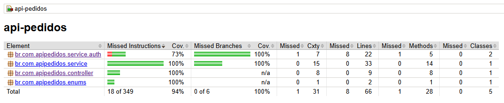

# Prova Cote Fácil

Sistema composto por dois microsserviços desenvolvidos com Spring Boot:

- `api-gateway`: responsável pela autenticação JWT, autorização e roteamento das requisições.
- `api-pedidos`: responsável pelo gerenciamento de pedidos e itens de pedidos.

Arquitetura baseada em gateway + microsserviço interno, utilizando comunicação HTTP entre containers Docker.

## Tecnologias

- Java
- Spring Boot
- Spring Security
- Spring Data JPA
- Spring WebFlux (`WebClient`)
- JWT (`java-jwt`)
- Flyway
- H2 Database
- Docker / Docker Compose
- Swagger OpenAPI
- JUnit + Mockito
- JaCoCo

## Estrutura

```text
prova-cotefacil/
├── api-gateway/
│   ├── autenticação JWT
│   ├── proxy para API de pedidos
│   └── documentação Swagger
├── api-pedidos/
│   ├── CRUD de pedidos
│   ├── gerenciamento de itens
│   ├── validação JWT
│   └── documentação Swagger
└── compose.yaml
```

---

# Como executar o projeto

Gerar build:

```bash
mvn clean package
```

Subir containers:

```bash
docker compose up --build
```

Serviços disponíveis:

| Serviço | URL |
|----------|-----|
| API Gateway | http://localhost:8080 |
| Swagger Gateway | http://localhost:8080/swagger-ui/index.html |
| API Pedidos* | http://localhost:8081 |
| Swagger Pedidos* | http://localhost:8081/swagger-ui/index.html |

\* Exposto apenas em ambiente de desenvolvimento.

---

# Credenciais de teste

Usuário padrão:

```json
{
  "username": "usuario",
  "password": "senha123"
}
```

Realizar login:

```http
POST /auth/login
```

Body:

```json
{
  "username": "usuario",
  "password": "senha123"
}
```

Resposta:

```json
{
  "token": "Bearer eyJ..."
}
```

Utilize o token:

```http
Authorization: Bearer eyJ...
```

---

# Endpoints disponíveis

## Autenticação

| Método | Endpoint | Descrição |
|---------|-----------|------------|
| POST | `/auth/login` | Realiza autenticação |

## Pedidos

| Método | Endpoint | Descrição |
|---------|-----------|------------|
| GET | `/api/orders` | Lista pedidos |
| GET | `/api/orders/{id}` | Busca pedido |
| POST | `/api/orders` | Cria pedido |
| PUT | `/api/orders/{id}` | Atualiza pedido |
| DELETE | `/api/orders/{id}` | Remove pedido |
| GET | `/api/orders/{id}/items` | Lista itens |
| POST | `/api/orders/{id}/items` | Adiciona item |

---

# Exemplos de requisições

Criar pedido:

```http
POST /api/orders
Authorization: Bearer <token>
Content-Type: application/json
```

Body:

```json
{
  "customerName": "João Silva",
  "customerEmail": "joao@email.com",
  "status": "PENDING"
}
```

Adicionar item:

```http
POST /api/orders/1/items
Authorization: Bearer <token>
Content-Type: application/json
```

Body:

```json
{
  "productName": "Dipirona 1g",
  "quantity": 2,
  "unitPrice": 12.50
}
```

---

# Segurança

Fluxo:

1. Usuário realiza login na `api-gateway`
2. JWT é gerado contendo identidade e roles
3. Token é enviado nas requisições subsequentes
4. `api-gateway` repassa o JWT para `api-pedidos`
5. `api-pedidos` valida assinatura e expiração do token

A API de pedidos permanece acessível apenas pela rede interna Docker.

---

# Cobertura de Testes

Os testes automatizados priorizam:

- Regras de negócio (`Service`)
- Autenticação JWT
- Filtros de segurança
- Tratamento de exceções
- Controllers com comportamento próprio

Camadas estruturais foram excluídas do JaCoCo para evitar inflação artificial de cobertura:

```text
dto/
entity/
assembler/
config/
Application
```

Essas classes possuem baixo valor funcional para testes unitários.

## Cobertura obtida

### API Gateway: 89%



### API Pedidos: 94%



A cobertura prioriza validação de comportamentos críticos em vez de percentual absoluto.

---

# Executar testes

```bash
mvn test
```

Relatório JaCoCo:

```text
target/site/jacoco/index.html
```